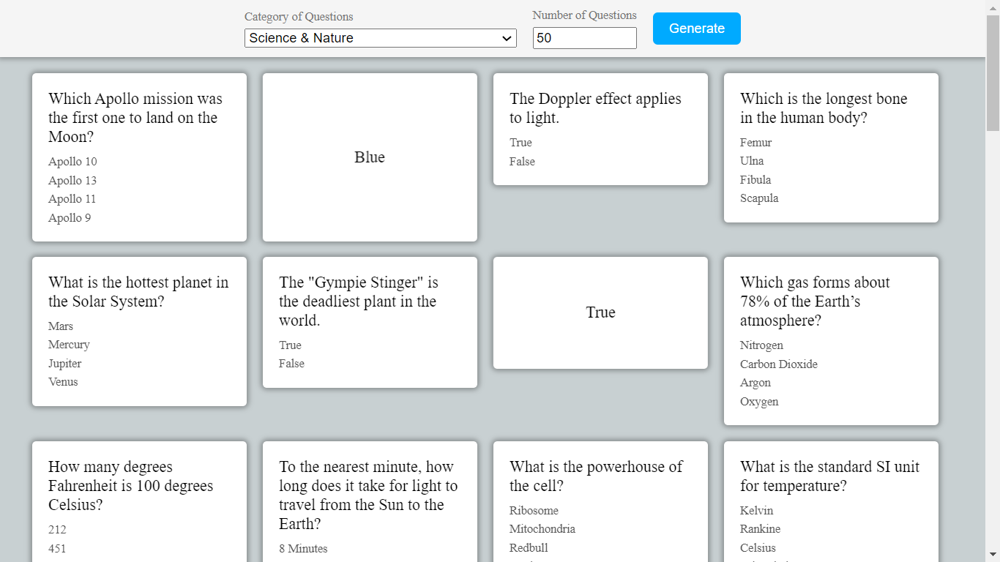

<h1 align='center'>FlashCard Quiz App</h1>
<h2 align='center'><a href="https://cenacrharsh.github.io/flashcard-quiz-app-react/">✨ DEMO</a></h2>

🎯 Lessons Learned:

- API used : OPEN TRIVIA DATABASE
- USED AXIOS package for API calls.
- USED `backface-visibility: hidden`, `transform-style: preserve-3d` & `transform: perspective(1000px)` in CSS
- USED `getBoundingClientRect().height` to dynamically calculate heights.
- HOOKS used `useState()`, `useRef()`, `useEffect()`
